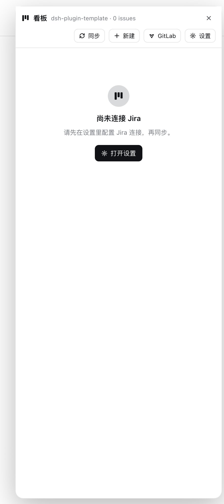
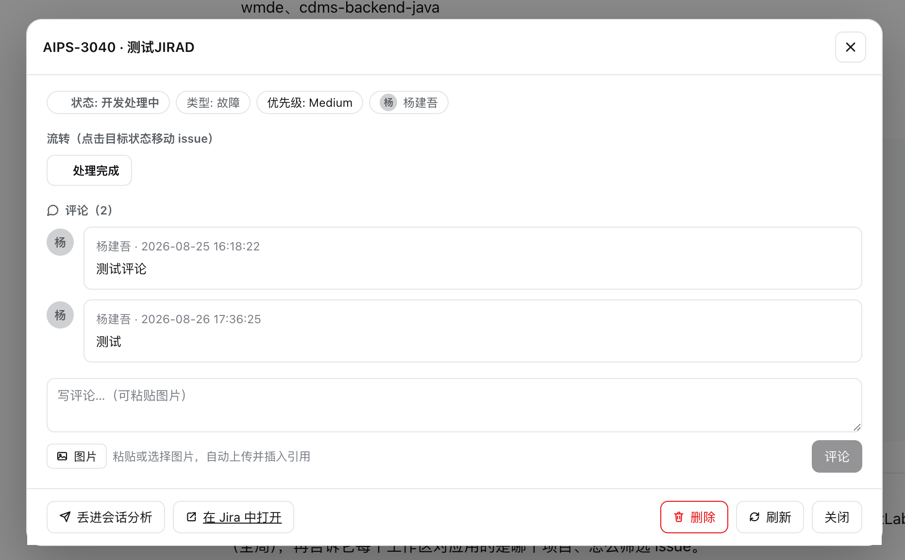
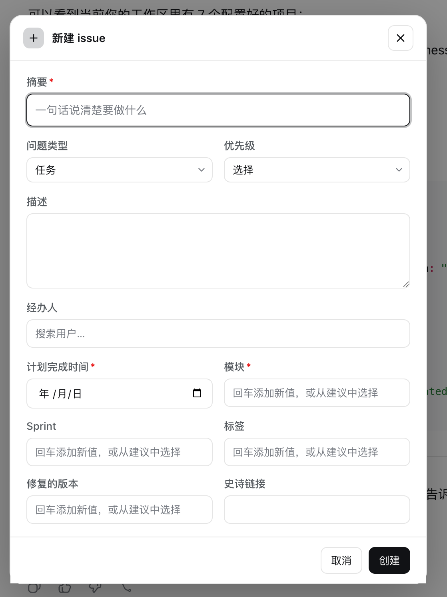
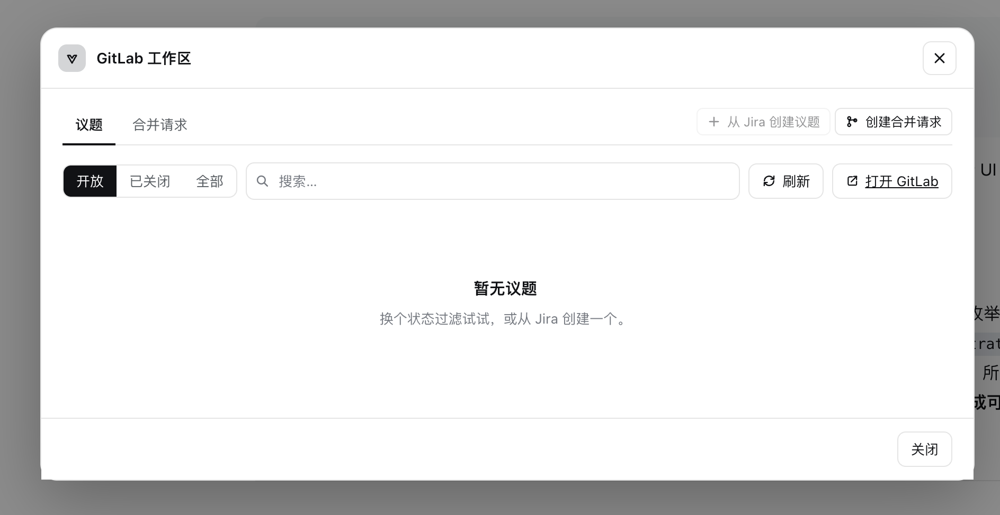
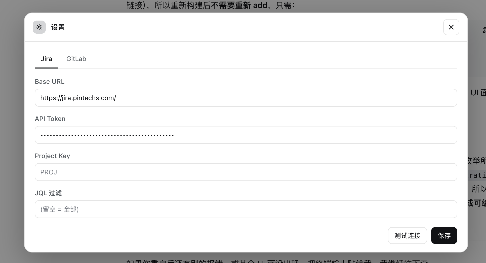

# dsh-kanban

**English** | [简体中文](README.zh-CN.md)

A [DeepSeek Harness](https://github.com/deepseek-ai/deepseek-harness) (`dsh`) plugin
that turns a **Jira Server / Data Center + GitLab** board into a kanban **the agent
can actually work** — every DSH workspace is a board project, the model drives the
board through tools, and a floating panel in the session header gives you the human
view.

## Screenshots

| Floating panel | Issue detail | Create issue |
|---|---|---|
|  |  |  |

| GitLab workspace | Settings |
|---|---|
|  |  |

## Highlights

- **One project per DSH workspace.** The board derives one project from every
  workspace: its own Jira connection, GitLab connection, and local-repo config,
  plus its own cached issues.
- **The panel follows your workspace.** Open the board from the session-header
  「看板」button; the panel tracks the *currently selected session* and reloads
  for that workspace's project automatically. Switch sessions → the board
  follows.
- **Auto-sync on open.** Each project syncs from Jira once per panel session
  (cached issues show instantly; the sync runs in the background). After
  configuring Jira, it syncs once as well.
- **Grouped board for narrow panels.** Status groups with category accents,
  collapsible sections, counts, and client-side search. Move an issue via
  click → detail → transition buttons (keyboard friendly).
- **Full issue detail.** Rendered description (Jira images proxied through the
  host so the browser needs no token), attachment links, transitions, comments
  with paste/attach image upload, and a lightbox.
- **Create issues with Jira's own metadata.** The form is driven by Jira's
  createmeta API: required markers, auto-selected issue type, priority beside
  type, assignee search, chip-style multi-value fields (components/labels),
  and inline error reporting from Jira.
- **GitLab workspace.** Issues and merge requests with state filters, search,
  open-in-GitLab links, create-an-issue from selected Jira issues, link Jira,
  create an MR (existing/new branch, branch preview, linked issues).
- **Send-to-session analysis.** From the issue detail, push an *analyze-only*
  request into the current session — or a brand-new session in the current
  workspace — through the official `ISession.prompt` /
  `workspaces.startSession()` entry points. Image attachments ride along as
  image content parts (base64), so vision-capable models can actually see
  them; the instruction tells the agent to pull live data with `kanban-issue`
  and to analyze without modifying anything.
- **Agent-side tools with rich chat rendering.** Tool results render as board
  columns, issue details, project lists, and sync stats directly in the
  conversation.

## Install as a bundle (for users)

```sh
dsh plugin --profile demo add /path/to/dsh-ui-kanban
# or from git
dsh plugin --profile demo add github:you/dsh-ui-kanban
```

> On pnpm ≥10 the first git-dependency `prepare` is refused; add the package to
> the profile's `pnpm-workspace.yaml` `allowBuilds` and retry.

Verify the config layer and boot:

```sh
dsh --profile demo --dump-config     # should show a "# == dsh-kanban" layer
dsh --profile demo
```

For the Web GUI + config card, use the `web` profile:

```sh
pnpm build
dsh plugin --profile web add /path/to/dsh-ui-kanban
dsh web
```

## Configuration

The `dsh-kanban` settings namespace resolves: **schema defaults → cordis.yml
base → user document**. Common settings are at the top; projects are nested.

```yaml
- insert:
    - id: dsh-kanban
      name: dsh-kanban
      config:
        dataDir: ''            # empty => ~/.dsh/kanban (env KANBAN_DATA_DIR wins)
        allowSelfSigned: true  # common default for GitLab self-signed TLS
        verbose: false
        jira:                  # GLOBAL Jira host + token, inherited by every workspace
          baseUrl: 'https://jira.example.com'
          apiToken: ''
        gitlab:                # GLOBAL GitLab host + token, inherited by every workspace
          baseUrl: ''          # e.g. https://gitlab.example.com
          apiToken: ''
        projects:              # per-workspace OVERRIDES (keyed by workspace id)
          - id: default        # workspace id
            name: Default      # optional display override (default = workspace title)
            jira:
              projectKey: 'PROJ'
              jql: ''          # `project = <key>` is auto-prepended
            gitlab:
              project: ''      # group/repo or full URL (auto-normalized)
            localRepo:
              directory: ''    # empty => the workspace's own path
```

The board auto-derives **one project per DSH workspace** (`id` = workspace id, `name` =
workspace title, `localRepo.directory` defaults to the workspace path). Every
workspace inherits the global Jira / GitLab host + token; `projects` only carries
the per-workspace overrides the user changes. The "current project" follows the
**current session's workspace** — there is no global `activeProject`.

Jira tokens and GitLab tokens are `role('secret')`; the GUI card edits only the
global host/token (a blank password keeps the host-side secret), and per-workspace
connection overrides are managed with the `kanban-configure` tool.

## The floating panel

Opened from the session-header 「看板」button (`conversation.session.header.utilities`
→ `shell.overlay`). The panel:

- follows the **currently selected session**'s workspace (falls back to the
  opening session when none is selected) and reloads when it changes;
- auto-syncs each project once per panel session, then silently refreshes;
- shows a status-grouped issue list: category color accents, collapsible
  groups, issue counts, and client-side search (key / summary / assignee /
  status);
- opens the issue detail on click (Enter/Space works): rendered description,
  attachment links, transitions as action buttons, comments with image
  paste/attach, and the 「丢进会话分析」action;
- hosts the GitLab workspace (issues / merge requests, create from Jira, link
  Jira, create MR) and the settings dialog (Jira / GitLab connections).

## What it gives the agent

The host half registers 14 model-callable tools. Real Jira/GitLab work (and the
on-disk issue cache) stays in the host half — nothing Jira/GitLab ships to the
browser, and tokens are `role('secret')` so the web surface never echoes them.

| Tool | Purpose |
|------|---------|
| `kanban-projects` | List projects (workspaces), their Jira keys, sync state, active one. |
| `kanban-set-active-project` | Set which project tools operate on by default. |
| `kanban-configure` | Set a project's Jira / GitLab / local-repo connection. |
| `kanban-sync` | Pull issues from Jira into the local cache (added/updated counts). |
| `kanban-issues` | Read the cached board, grouped by status column. |
| `kanban-issue` | Live detail: description, attachments, transitions, comments, canDelete. |
| `kanban-move` | Move an issue via a workflow transition. |
| `kanban-create` | Create a Jira issue (and cache it). |
| `kanban-comment` | Comment on an issue. |
| `kanban-gitlab-issues` | GitLab issues (with linked Jira keys + MR). |
| `kanban-gitlab-mrs` | GitLab MRs (with issues + Jira keys). |
| `kanban-gitlab-create-issue` | Create one GitLab issue from one or more Jira issues. |
| `kanban-gitlab-create-mr` | Create a GitLab MR (optionally from a new branch). |
| `kanban-gitlab-link-jira` | Link Jira keys to a GitLab issue. |

## Send-to-session analysis

The issue detail has a **「丢进会话分析」** action. After a confirm dialog
(current session / new session in the current workspace):

1. the panel sends a prompt through the official `ISession.prompt` entry point
   (new sessions go through `workspaces.startSession()`, which creates and
   opens a session in the current workspace);
2. the message carries only the issue key plus an instruction to call
   `kanban-issue` for the latest details and to **analyze without modifying
   anything** — the agent pulls live data through the tool, and the chat
   renders it with the same rich toolview;
3. image attachments are fetched through the host proxy and attached as image
   content parts (base64), so vision-capable models see them; text-only models
   degrade gracefully (the harness substitutes a text placeholder).

## Local development

From a `deepseek-harness` checkout root, load this repo's source via overlay
(host half only, no install):

```sh
cp dev/cordis.example.yml dev/cordis.yml   # template -> local file (gitignored)
# edit dev/cordis.yml: set `name` to this repo's absolute path
pnpm dsh web --patch /absolute/path/to/dsh-ui-kanban/dev/cordis.yml
```

To test the browser-half config card, install into a profile (see above).

Run the checks:

```sh
pnpm install
pnpm typecheck
pnpm build
node test/smoke.mjs
```

`test/smoke.mjs` verifies the host module loads and registers the tools, the
settings-namespace wiring, the backend resolving projects offline, and that the
browser `lib/client.js` executes its `__ModuleLoader__` handshake.

## How the browser half works

- `package.json` declares `dsh.client: { platform: "web" }` +
  `exports["./client"]`; dsh's client-modules loads `lib/client.js` as a browser
  plugin.
- `src/client/index.ts` registers the surfaces — the config card
  (`settings.plugin.item`), custom tool-result views
  (`tool.call.toolview` keyed by the kanban tool names), and a session-scoped
  floating panel opened from the session header "看板" button
  (`conversation.session.header.utilities` → `shell.overlay`), the only entry
  to the interactive board. See [docs/ui-surfaces.md](docs/ui-surfaces.md).
- The board renders from the structured `output.presentationMeta` the host half
  emits for each tool call; no arbitrary RPC to the host is needed.
- Runtime client deps: `react` only; everything else (icons, modals, toasts) is
  inlined. All colors ride the host theme variables (`--dsw-alias-*`), so light
  and dark themes adapt automatically.

## Making it your own

Rename the package consistently across `package.json` `name`, `src/index.ts`
`name`/`NAMESPACE`, `cordis.patch.yml` `id`/`name`, the client bundle `id` in
`tsdown.config.ts`, and `src/client/constants.ts`. Add/remove fields in
`src/config.ts` (Config + schema) and mirror scalar fields in the config card.

## Publishing

- **npm**: `pnpm publish`
- **tarball**: `pnpm pack`, then `dsh plugin add ./dsh-kanban-0.1.0.tgz`
- **git**: `dsh plugin add github:you/dsh-ui-kanban`

## License

MIT
